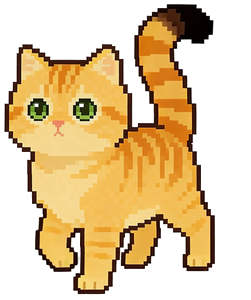

# Homepage Redesign Plan

## Overview

Seven changes to the current single-scroll academic portfolio:

1. **Typography upgrade** — switch from Roboto to Inter, set intentional type scale
2. **Penn color scheme** — apply UPenn colors precisely, remove visual noise from current CSS
3. **Paginated / tab-based layout** — one section visible at a time, URL-hash-aware
4. **Hero section polish** — cleaner layout, better photo presentation
5. **Multi-state cat widget** — walk → pause → wink → walk, with click interaction
6. **Blog section** — new blog listing page + blog tab on homepage
7. **Comments on blog posts** — Utterances (GitHub Issues–based, free, no ads)

---

## 1. Typography Upgrade

The current `main.css` uses `"Roboto", Helvetica, Arial, sans-serif` — a generic stack that screams default. Switching to **Inter** makes a huge visible difference at zero cost.

### Add to `<head>` in `index.html`:
```html
<link rel="preconnect" href="https://fonts.googleapis.com">
<link rel="preconnect" href="https://fonts.gstatic.com" crossorigin>
<link href="https://fonts.googleapis.com/css2?family=Inter:wght@400;500;600;700&display=swap" rel="stylesheet">
```

### Add to `css/custom.css`:
```css
body {
  font-family: 'Inter', -apple-system, BlinkMacSystemFont, sans-serif;
  font-size: 15.5px;
  line-height: 1.65;
  letter-spacing: -0.005em;
  color: #1a2332;
}

/* Headings use slightly tighter tracking */
.md-heading {
  font-weight: 700;
  letter-spacing: -0.02em;
  line-height: 1.2;
}

/* Body text is weight 400, metadata/labels are 500, headings 600–700 */
```

**Why this matters:** Inter is humanist, has open apertures, and reads as "designed" rather than "default." The weight and tracking choices add intentionality.

---

## 2. Penn Color Scheme + Visual Noise Reduction

### Full Penn palette (official):

| Token | Hex | Role |
|---|---|---|
| Penn Blue | `#011F5B` | Primary brand, headings, nav accent, CTA buttons, awards badge |
| Penn Red | `#990000` | Accent only — timeline dots, active tab underline, `#my-title`, bio-highlight border |
| Penn Light Blue | `#82AFD3` | Secondary accent — tags, date badges, info-card eyebrow, link hover |
| Penn Gold | `#F2C100` | Highlight sparingly — e.g. starred/featured pub, hover on cat widget border |
| Black | `#000000` | Only for high-contrast text needs (avoid on body copy) |
| White | `#FFFFFF` | Card backgrounds, reversed text |
| Off-White | `#F7F7F7` | Page background (replaces current `#f9f9f9`) |
| Light Gray | `#F2F2F2` | Section alternates, `bio-highlight` bg, `teaching-card` bg |

### CSS custom properties (top of `custom.css`):
```css
:root {
  /* Penn official palette */
  --penn-blue:        #011F5B;
  --penn-red:         #990000;
  --penn-light-blue:  #82AFD3;
  --penn-gold:        #F2C100;
  --penn-black:       #000000;
  --penn-white:       #FFFFFF;
  --penn-off-white:   #F7F7F7;
  --penn-light-gray:  #F2F2F2;

  /* Derived tints (used for bg fills, borders) */
  --blue-tint-5:   rgba(1, 31, 91, 0.05);
  --blue-tint-10:  rgba(1, 31, 91, 0.10);
  --light-blue-tint: rgba(130, 175, 211, 0.18);

  /* Semantic text roles */
  --text-main:     #0a1628;   /* near-black with blue undertone */
  --text-sub:      #3a4a5c;
  --text-muted:    #68788a;

  /* Borders */
  --border:        rgba(1, 31, 91, 0.12);

  /* Shadow scale — use these and nothing else */
  --shadow-sm:  0 1px 3px rgba(1, 31, 91, 0.06);
  --shadow-md:  0 4px 12px rgba(1, 31, 91, 0.09);
  --shadow-lg:  0 8px 24px rgba(1, 31, 91, 0.12);
}
```

### Palette application map:

| Element | Color |
|---|---|
| `.site-header` top border (3px) | `--penn-blue` |
| `.md-heading` text | `--penn-blue` |
| `.md-heading i` icon | `--penn-red` |
| `.bio-highlight` left border | `--penn-red` |
| `.bio-highlight` background | `var(--penn-light-gray)` |
| `.timeline-entry::before` dot | `--penn-red` |
| `.timeline-entry__role` | `--penn-blue` |
| `.news-list__date` badge bg | `--light-blue-tint` |
| `.news-list__date` badge text | `--penn-blue` |
| `.awards-list__year` badge | `--penn-blue` bg, white text |
| `.tags .tag` bg | `--light-blue-tint` |
| `.tags .tag` text | `--penn-blue` |
| `.tags .tag:hover` bg | `rgba(130,175,211,0.35)` |
| `.pub-right > .title` | `--penn-blue` |
| `.info-card__eyebrow` | `--penn-red` |
| `.teaching-card__term` badge | `--light-blue-tint`, `--penn-blue` text |
| Active tab underline | `--penn-red` |
| Active tab text | `--penn-red` |
| CTA button ("Visit Blog →") | `--penn-blue` bg, white text |
| Page background (`body`) | `--penn-off-white` |
| Card backgrounds | `--penn-white` |
| `#my-title` | `--penn-red` |
| `#my-name` | `--penn-blue` |

### What to fix in current `custom.css`:

**The problem:** `custom.css` currently uses 5 different ad-hoc blue values (`#6c86ad`, `#305d96`, `#365072`, `#303f55`, `#1e2d3f`) and 6 different shadow declarations.

**Replacements:**
| Old value | Replace with |
|---|---|
| `#6c86ad` (muted blue) | `var(--penn-light-blue)` |
| `#305d96` (medium blue) | `var(--penn-blue)` |
| `#365072`, `#223041`, `#1e2d3f` | `var(--penn-blue)` |
| `#303f55` (awards year bg) | `var(--penn-blue)` |
| `#eef3fb` (tint bg) | `var(--light-blue-tint)` |
| `#f6f8fc` (bio highlight bg) | `var(--penn-light-gray)` |
| `#394553`, `#2a3748`, `#2f3a47` (body text) | `var(--text-main)` |
| `#515d6c`, `#556477`, `#51606f` (sub text) | `var(--text-sub)` |
| `#68768a` (muted) | `var(--text-muted)` |
| All box-shadows | `var(--shadow-sm)` / `var(--shadow-md)` |

**Remove the `.teaching-card` gradient:**
```css
/* Before */
background: linear-gradient(135deg, #f3f6fb 0%, #ffffff 100%);
/* After */
background: var(--penn-light-gray);
```

**Consistent border-radius scale:**
- `999px` — pills (tags, date badges)
- `8px` — small cards, info-cards
- `12px` — publication cards, teaching cards
- `0` / no radius — timeline (structural look)

**Nav accent:**
```css
.site-header {
  border-top: 3px solid var(--penn-blue) !important;
  border-bottom: 1px solid var(--border) !important;
}
```

---

## 3. Paginated / Tab-based Layout

### Nav tabs (replace current anchor links in `index.html`)

| Tab label | Section ID | Content |
|---|---|---|
| About | `#section-about` | Bio paragraph + bio-highlight + News list |
| Experience | `#section-experience` | Education timeline + Experiences timeline |
| Research | `#section-research` | Selected Publications |
| Service | `#section-service` | Academic Services + Teaching + Honors & Awards |
| Blog | `#section-blog` | Blog preview / CTA (links to `/blog`) |

### CSS mechanism:
```css
.page-section {
  display: none;
  animation: fadeUp 0.3s ease both;
}
.page-section.active {
  display: block;
}
@keyframes fadeUp {
  from { opacity: 0; transform: translateY(10px); }
  to   { opacity: 1; transform: translateY(0); }
}

/* Tab link styles */
.tab-link {
  font-weight: 500;
  color: var(--text-sub);
  text-decoration: none;
  padding-bottom: 3px;
  border-bottom: 2px solid transparent;
  transition: color 0.2s, border-color 0.2s;
}
.tab-link.active {
  color: var(--penn-red);
  border-bottom-color: var(--penn-red);
}
.tab-link:hover:not(.active) {
  color: var(--penn-blue);
}
```

### JavaScript (near `</body>` in `index.html`):
```js
(function () {
  const tabs = document.querySelectorAll('.tab-link');
  const sections = document.querySelectorAll('.page-section');

  function activate(id) {
    tabs.forEach(t => t.classList.toggle('active', t.dataset.section === id));
    sections.forEach(s => {
      const on = s.id === id;
      s.classList.toggle('active', on);
      // re-trigger animation
      if (on) { s.style.animation = 'none'; s.offsetHeight; s.style.animation = ''; }
    });
    history.replaceState(null, '', '#' + id);
    window.scrollTo({ top: 0, behavior: 'smooth' });
  }

  tabs.forEach(t => t.addEventListener('click', e => {
    e.preventDefault();
    activate(t.dataset.section);
  }));

  // honour URL hash on load
  const hash = location.hash.replace('#', '');
  const initial = [...tabs].find(t => t.dataset.section === hash) ? hash : 'section-about';
  activate(initial);
})();
```

### Changes to `index.html` nav:
```html
<div class="trigger">
  <a class="tab-link" data-section="section-about"      href="#section-about">About</a>
  <a class="tab-link" data-section="section-experience" href="#section-experience">Experience</a>
  <a class="tab-link" data-section="section-research"   href="#section-research">Research</a>
  <a class="tab-link" data-section="section-service"    href="#section-service">Service</a>
  <a class="tab-link" data-section="section-blog"       href="#section-blog">Blog</a>
</div>
```

### Content reordering:
- Remove the 3 separate `<div class="wrapper">` wrappers for services/teaching/awards
- Move `#news` immediately after `#bio` inside `#section-about`
- Fold Academic Services + Teaching + Awards into one `#section-service` div

---

## 4. Hero Section Polish

The current `#profile-cover` / `.shallow-bg` area is dated. Goal: clean, modern, not over-designed.

### Changes:
- Remove the `shallow-bg` gradient class or override it with a clean white-to-faint-blue gradient:
  ```css
  #profile-cover {
    background: linear-gradient(160deg, #f8f9fb 0%, #eef3fb 100%);
    padding: 48px 0 40px;
  }
  ```
- Make the profile photo larger and give it a Penn Blue ring on hover:
  ```css
  #profile-avatar {
    width: 120px;
    height: 120px;
    border-radius: 50%;
    border: 3px solid var(--border);
    transition: border-color 0.3s ease;
  }
  #profile-avatar:hover {
    border-color: var(--penn-blue);
  }
  ```
- Increase `#my-name` font-size to ~1.6rem, use `font-weight: 700`
- `#my-title` use `var(--penn-red)` color

---

## 5. Multi-State Pixel Cat Widget

You have multiple animation sets:
- `images/cat/walk/walk_f0.png … walk_f7.png` — 8-frame walk cycle
- `images/cat/wink/cat_wink.gif` — wink animation
- `images/cat/wink/cat_wink_left.gif`, `images/cat/wink/cat_wink_right.gif` — directional winks
- `images/cat/sleep/cat_yawn.gif` — yawn
- `images/cat/coke/cat_drink_coke.gif` — drinking coke (use as Easter egg on click!)

### Behavior state machine:
```
WALKING: cat crosses screen left→right (16s)
  → arrives at right edge
  → PAUSING: cat sits, plays cat_wink.gif for 2s
  → WALKING again (loops)

ON CLICK: immediately play cat_drink_coke.gif for 1.5s, then resume
```

### HTML (in `index.html` before `</body>`):
```html
<div id="cat-widget">
  
</div>
```

### CSS:
```css
#cat-widget {
  position: fixed;
  bottom: 12px;
  left: -80px;
  z-index: 9000;
  pointer-events: auto;
  cursor: pointer;
  transition: none;
}
#cat-widget img {
  width: 64px;
  image-rendering: pixelated;
  image-rendering: crisp-edges;
}
```

### JavaScript (state machine, replaces the simple setInterval from original plan):
```js
(function () {
  const widget = document.getElementById('cat-widget');
  const img    = document.getElementById('cat-frame');
  if (!widget || !img) return;

  const WALK_FRAMES = Array.from({length: 8}, (_, i) => `images/cat/walk/walk_f${i}.png`);
  const WALK_DURATION_MS = 16000;  // 16s to cross screen
  const FRAME_MS = 120;

  let frameIdx = 0;
  let walkTimer = null;
  let frameTimer = null;
  let state = 'walking';  // 'walking' | 'pausing' | 'coke'
  let walkStart = null;

  function startWalk() {
    state = 'walking';
    widget.style.transition = `left ${WALK_DURATION_MS}ms linear`;
    widget.style.left = '-80px';
    // force reflow so transition fires
    widget.offsetHeight;
    widget.style.left = 'calc(100vw + 80px)';
    walkStart = Date.now();

    frameTimer = setInterval(() => {
      frameIdx = (frameIdx + 1) % 8;
      img.src = WALK_FRAMES[frameIdx];
    }, FRAME_MS);

    walkTimer = setTimeout(startPause, WALK_DURATION_MS);
  }

  function startPause() {
    clearInterval(frameTimer);
    state = 'pausing';
    widget.style.transition = 'none';
    widget.style.left = 'calc(100vw - 80px)';
    img.src = 'images/cat/wink/cat_wink.gif';
    setTimeout(startWalk, 2500);
  }

  // Click: play coke Easter egg
  widget.addEventListener('click', () => {
    if (state === 'coke') return;
    clearTimeout(walkTimer);
    clearInterval(frameTimer);
    state = 'coke';
    widget.style.transition = 'none';
    img.src = 'images/cat/coke/cat_drink_coke.gif';
    setTimeout(startWalk, 2000);
  });

  // Kick off
  startWalk();
})();
```

**Why this is better than the original plan:** Multiple states with real GIFs makes the cat feel alive rather than just a looping CSS animation. The coke Easter egg adds personality that cannot come from AI defaults.

---

## 6. Blog Section

### `blog.html` (new Jekyll page)
```yaml
---
layout: default
title: Blog
permalink: /blog/
---
```
- Lists all `site.posts` using Liquid: date badge, title link, excerpt, tags
- Penn-styled cards, consistent with main site look
- "← Back to home" link

### Blog tab on homepage (`#section-blog`)
Since `index.html` is not a Jekyll Liquid template, this section is **static**:
- A short intro paragraph ("Occasional writing on research, tools, and things I find interesting")
- A styled "Visit Blog →" CTA button in Penn Blue
- 3–5 most recent posts listed manually (title + date) once there's content

---

## 7. Blog Comments — Utterances

### New file: `_includes/utterances.html`
```html
<script src="https://utteranc.es/client.js"
        repo="Espere-1119-Song/Espere-1119-Song.github.io"
        issue-term="pathname"
        label="blog-comment"
        theme="github-light"
        crossorigin="anonymous"
        async>
</script>
```

### Update `_layouts/post.html` — replace Disqus block with:
```html
<div class="post-comments">
  
</div>
```

**Setup required:** Install the Utterances GitHub App at https://utteranc.es on your repo. The repo must be public.

---

## Implementation Order

Do these in order — each step is independently testable:

1. **Typography** (`css/custom.css` + `<head>`) — visible immediately, no structural risk
2. **CSS variable refactor** (`css/custom.css`) — replace ad-hoc hex values; verify nothing breaks visually
3. **Hero polish** (`css/custom.css` + hero HTML) — isolated to `#profile-cover`
4. **Tab layout** (`index.html` nav + section wrappers + JS + CSS) — biggest structural change; do last among HTML edits
5. **Cat widget** (HTML + JS + CSS) — additive, no risk to existing content
6. **Blog page** (`blog.html` + `_includes/utterances.html` + `_layouts/post.html`) — additive

---

## Files Modified / Created

| File | Action | Change |
|---|---|---|
| `css/custom.css` | **Edit** | CSS variables, typography, Penn colors, tab CSS, hero CSS, cat CSS, visual noise cleanup |
| `index.html` | **Edit** | Inter font link, new nav tabs + data-section attrs, section wrappers, hero HTML tweaks, cat widget HTML + JS, tab-switch JS |
| `blog.html` | **Create** | Jekyll page listing all posts with Penn styling |
| `_includes/utterances.html` | **Create** | Utterances comment widget snippet |
| `_layouts/post.html` | **Edit** | Replace Disqus block with Utterances include |

---

## Skills to Use During Implementation

- **`/simplify`** — run after completing `css/custom.css` edits to check for redundant selectors, duplicate values, and unused rules
- **`remotion-render`** — *optional*: if you want to preview/prototype the cat state-machine animation logic before writing it into the site, Remotion can render the frame-cycling logic as a video

---

## Open Questions

1. **Cat on every page or homepage only?**  
   Currently planned: homepage only. To put it on every page, move widget HTML + JS into `_includes/cat_widget.html` and include it in `_layouts/default.html`.

2. **Dark mode?**  
   Not in current plan but natural next step. Penn Blue works well as a dark-mode surface color (`#011F5B` as background, white text). Add a `prefers-color-scheme: dark` media query block.

3. **Blog tab — dynamic vs. static?**  
   If you want the Blog tab to auto-list your latest posts, convert `index.html` to a Jekyll template (add `---\n---` front matter). Otherwise it stays static with a link to `/blog`.

4. **Utterances installation**  
   You need to install the Utterances GitHub App on your repo before comments appear. Steps: go to https://utteranc.es, click "install", select your repo.

5. **First blog post**  
   The only existing post is the Beautiful Jekyll template post. Write a real first post before going live with the Blog tab.
